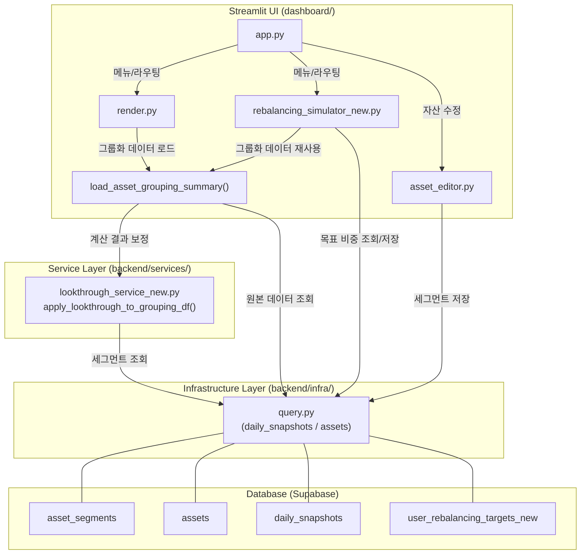

# Phase 5 통합 구조도 및 수정 포인트 분석

Phase 5의 핵심 과제인 **Look-through 분석**과 **리밸런싱 시뮬레이터**가 현재의 `asset-portfolio` 프로젝트 구조에 어떻게 통합되는지를 정리한 문서입니다.

## 1. Phase 5 전체 구조도 (Mermaid)

---

## 2. 과제별 수정 포인트 목록 (Modification Points)

실제 코드를 작성하지 않고, 재사용하거나 확장해야 할 주요 지점들을 정리했습니다.

### 과제 1: 복합 자산 Look-through 분석

TDF/펀드 내부 자산을 분해하여 집계하는 기능입니다.

| 파일 경로 | 함수/위치 | 수정 내용 |
| :--- | :--- | :--- |
| [src/asset_portfolio/backend/infra/query.py](file:///c:/Users/MartinChoi/Documents/WorkSpace/asset-portfolio/src/asset_portfolio/backend/infra/query.py) | (신규 함수 추가) | `get_asset_segments(asset_id)`, `upsert_asset_segments(asset_id, segments)` 추가 |
| [src/asset_portfolio/dashboard/render.py](file:///c:/Users/MartinChoi/Documents/WorkSpace/asset-portfolio/src/asset_portfolio/dashboard/render.py) | [load_asset_grouping_summary()](file:///c:/Users/MartinChoi/Documents/WorkSpace/asset-portfolio/src/asset_portfolio/dashboard/render.py#44-137) (L45) | DB에서 데이터를 가져온 직후, `LookthroughService`를 호출하여 시가총액을 세그먼트별로 분해(Explode) 처리하도록 확장 |
| [src/asset_portfolio/dashboard/asset_editor.py](file:///c:/Users/MartinChoi/Documents/WorkSpace/asset-portfolio/src/asset_portfolio/dashboard/asset_editor.py) | `render_asset_editor()` | `lookthrough_available=True`인 자산에 대해 세그먼트(자산군/비중)를 입력할 수 있는 테이블 UI 추가 |

---

### 과제 3: 리밸런싱 시뮬레이터

목표 비중 대비 현재 비중을 비교하고 매수/매도액을 계산하는 기능입니다.

| 파일 경로 | 함수/위치 | 수정 내용 |
| :--- | :--- | :--- |
| [src/asset_portfolio/backend/infra/query.py](file:///c:/Users/MartinChoi/Documents/WorkSpace/asset-portfolio/src/asset_portfolio/backend/infra/query.py) | (신규 함수 추가) | `user_rebalancing_targets` 테이블에 접근하기 위한 CRUD 함수 추가 |
| [src/asset_portfolio/dashboard/app.py](file:///c:/Users/MartinChoi/Documents/WorkSpace/asset-portfolio/src/asset_portfolio/dashboard/app.py) | `menu_items` (L107) | `"리밸런싱 시뮬레이터"` 메뉴 항목 추가 및 신규 페이지 라우팅 로직 삽입 |
| [src/asset_portfolio/dashboard/render.py](file:///c:/Users/MartinChoi/Documents/WorkSpace/asset-portfolio/src/asset_portfolio/dashboard/render.py) | [render_target_vs_actual_weight_section()](file:///c:/Users/MartinChoi/Documents/WorkSpace/asset-portfolio/src/asset_portfolio/dashboard/render.py#1246-1299) (L1246) | 현재는 하드코딩된 비중을 보여주는 Placeholder 성격이나, 이를 신규 시뮬레이터 페이지로 연결하거나 동조화되도록 로직 변경 |
| `src/asset_portfolio/dashboard/rebalancing_simulator.py` | (NEW) | **핵심 로직**: [load_asset_grouping_summary](file:///c:/Users/MartinChoi/Documents/WorkSpace/asset-portfolio/src/asset_portfolio/dashboard/render.py#44-137)를 재활용하여 Look-through가 적용된 현재 비중을 가져오고, DB의 목표 비중과 비교하여 Delta 계산 |

---

> [!TIP]
> **재사용의 핵심**: [load_asset_grouping_summary()](file:///c:/Users/MartinChoi/Documents/WorkSpace/asset-portfolio/src/asset_portfolio/dashboard/render.py#44-137) (render.py) 함수를 Look-through를 반영하도록 고도화하면, 파이 차트(과제 1)와 리밸런싱 시뮬레이터(과제 3) 모두에서 별도 로직 중복 없이 정확한 자산군 비중 데이터를 사용할 수 있게 됩니다.
